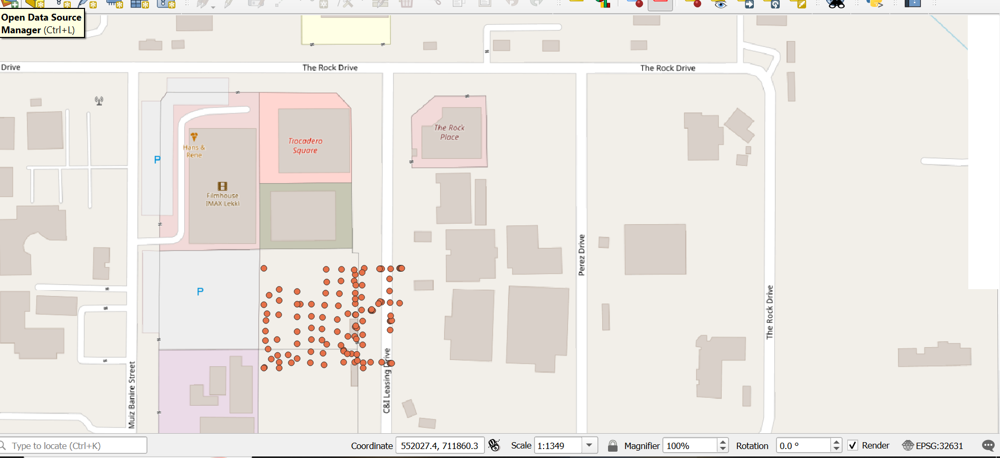

## Project Preview

# GIS Survey Point Mapping Project

## Overview
This project demonstrates the use of QGIS to process, visualize, and analyze survey coordinate data using real-world geospatial workflows.

## Objectives
- Import and manage survey coordinate data (Easting & Northing)
- Visualize spatial points on a basemap (OpenStreetMap)
- Handle Coordinate Reference Systems (CRS)
- Generate professional map layouts
- Export geospatial maps for reporting and presentation

## Tools Used
- QGIS
- OpenStreetMap
- CSV Survey Data
- GIS Mapping Techniques

## Workflow
1. Imported survey coordinate dataset
2. Defined correct CRS (Coordinate Reference System)
3. Plotted survey points on map canvas
4. Integrated OpenStreetMap basemap
5. Styled map for clarity and presentation
6. Exported final map as PDF and image

## Key Skills Demonstrated
- GIS Data Visualization
- Spatial Data Management
- Map Design and Cartography
- CRS Handling
- Geospatial Problem Solving

## Project Output
The repository contains:
- Final map image
- Exported PDF map
- Screenshots of QGIS workflow
